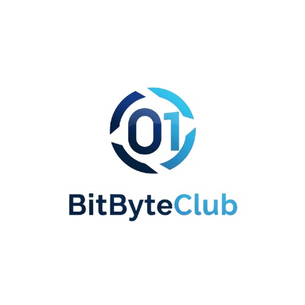
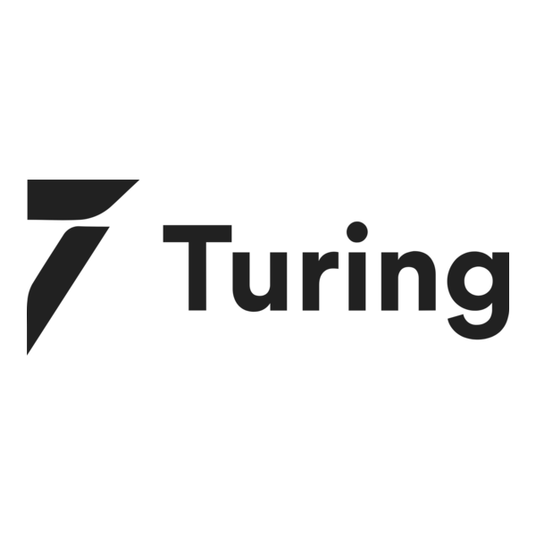
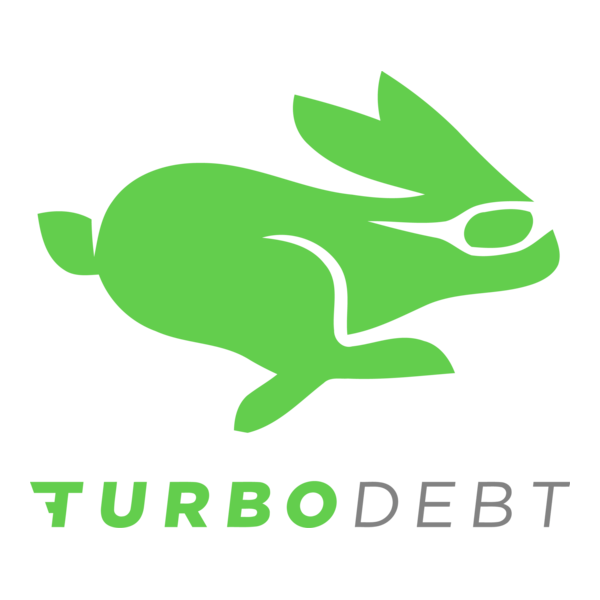
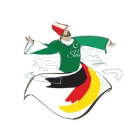
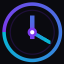
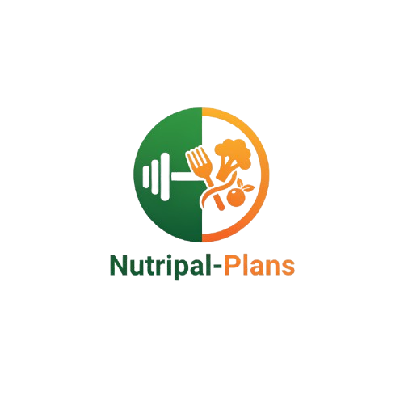
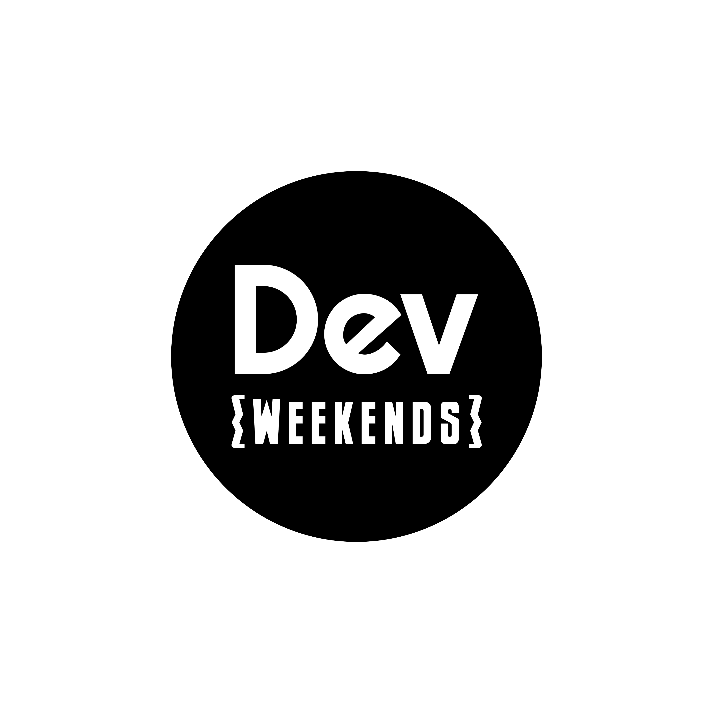
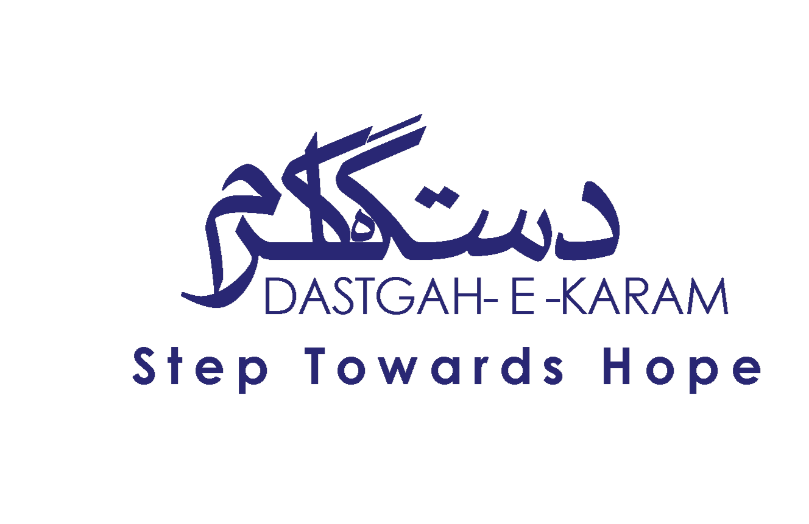

 

 

 

<!-- Stat Cards -->
<table>
<tr>
<td align="center" width="185">

</td>
<td align="center" width="185">

</td>
<td align="center" width="185">

</td>
<td align="center" width="185">

</td>
</tr>
</table>

 

<!-- Company Logos Strip -->

&nbsp;&nbsp;

&nbsp;&nbsp;

&nbsp;&nbsp;

&nbsp;&nbsp;

&nbsp;&nbsp;

---

### `> building systems that hold up under real load, not just demo-day performance`

 

<table>
<tr>
<td width="50%">

**Currently** shipping AI-driven MVPs and enterprise-grade multi-tenant platforms at **BitByteClub**, using Supabase Edge Functions, RAG pipelines, and vector databases. Previously evaluated frontier LLM reasoning benchmarks at **Turing** for Qwen and Tencent models.

</td>
<td width="50%">

**Beyond engineering,** I founded **Dastgah-e-Karam**, a humanitarian initiative in Lahore providing structured monthly support to 25-50 families, raising close to **PKR 3,000,000** across medical, educational, and flood relief efforts.

</td>
</tr>
</table>

---

## Experience

<table>
<tr>
<td width="72" align="center">

</td>
<td>
<strong>BitByteClub</strong> &nbsp;·&nbsp; Software Engineer 
Sep 2025 – Present · Lahore 
Shipped multiple AI-driven MVPs end-to-end using Supabase Edge Functions, OpenAI, RAG pipelines, and vector databases. Built modular enterprise admin platform with multi-tenant architecture, RLS-enforced tenant isolation, and secure token handling.
</td>
</tr>

<tr><td colspan="2"> </td></tr>

<tr>
<td width="72" align="center">

</td>
<td>
<strong>Turing</strong> &nbsp;·&nbsp; AI Reasoning & Evaluation Engineer <em>(Contract)</em> 
Oct 2025 – Mar 2026 
Designed high-quality reasoning benchmarks for frontier LLMs (Qwen, Tencent) with C/C++ reference implementations. Engineered training datasets improving multi-step reasoning, logical consistency, and adversarial robustness.
</td>
</tr>

<tr><td colspan="2"> </td></tr>

<tr>
<td width="72" align="center">

</td>
<td>
<strong>Xische & Co</strong> &nbsp;·&nbsp; Software Engineer <em>(Contract, Dubai)</em> 
Apr 2025 – Sep 2025 
RTK Query optimization cut redundant API calls by <strong>40%</strong>. Custom OCR pipeline reduced manual document processing by <strong>30%</strong>. Added i18next (EN/AR) and AWS + Docker CI/CD pipelines.
</td>
</tr>

<tr><td colspan="2"> </td></tr>

<tr>
<td width="72" align="center">

</td>
<td>
<strong>TurboDebt</strong> &nbsp;·&nbsp; Full Stack Developer <em>(US Fintech)</em> 
Nov 2023 – Dec 2024 
DigiCert certificate-based auth for <strong>1,000+ accounts</strong>. RabbitMQ messaging pipeline for real-time Telegram Bot support, contributing to a <strong>20% traffic increase</strong>. Performance improvements via lazy loading, code splitting, and debouncing.
</td>
</tr>

<tr><td colspan="2"> </td></tr>

<tr>
<td width="72" align="center">

</td>
<td>
<strong>Headstarter AI</strong> &nbsp;·&nbsp; Software Engineer Fellow 
Jul 2023 – Oct 2023 
Improved API response times <strong>30%</strong> across six AI tools. Onboarded <strong>500+ users</strong> in week one. Achieved <strong>1,500+ downloads</strong> through efficient architecture and automated workflows.
</td>
</tr>

<tr><td colspan="2"> </td></tr>

<tr>
<td width="72" align="center">

</td>
<td>
<strong>11 Seas Consultants</strong> &nbsp;·&nbsp; Frontend Developer 
Dec 2022 – Jun 2023 · Lahore 
Redesigned 20+ modular React components, accelerating feature development by <strong>35%</strong>. Improved mobile engagement <strong>25%</strong> across 10+ pages. Delivered UI features 30% faster and cut front-end bugs by nearly half.
</td>
</tr>
</table>

---

## Tech Stack

### Languages

### Frontend

### Backend

### Databases & Infrastructure

### AI & ML

### Auth & Security

### DevOps & Cloud
-232F3E?style=for-the-badge&logo=amazon-aws&logoColor=white)

---

## Projects

<table>
<tr>
<td width="50%">

### [Klokrs](https://github.com/Abdul-Moiz31/Klokrs) · Tab Time Tracker

A silent Chrome extension + dashboard for engineers who want honest data about their workday. Tracks every domain automatically with idle detection · no timers, no manual input.

**Stack:** Chrome Extension · Next.js · TypeScript · Supabase · Tailwind

- Automatic tab tracking with idle detection
- Daily / weekly / monthly breakdowns with PDF export
- 90-day heatmap and streak tracking
- Daily planner with domain-to-task mapping
- Pomodoro built into the dashboard

</td>
<td width="50%">

### [NexusAI](https://github.com/Abdul-Moiz31/NexusAI) · Multi-Agent AI Platform

Production-grade AI platform with four modes in one: streaming chat, ReAct agent with tools, LangGraph multi-agent orchestration, and RAG over uploaded documents.

**Stack:** FastAPI · LangGraph · React · ChromaDB · GPT-4o · Docker

- Multi-agent supervisor routing to specialist workers
- RAG pipeline: PDF ingest → embeddings → ChromaDB → cited answers
- Streaming SSE chat, web search + scraping tools
- Single Docker image, Render-deployable

</td>
</tr>
<tr>
<td width="50%">

### [Zero Hunger](https://github.com/Abdul-Moiz31/Zero-Hunger) · Food Rescue Platform

Connects food donors (restaurants, grocers) with NGOs and volunteers to move surplus food before it goes to waste.

**Stack:** React · Node.js · Express · MongoDB · Socket.IO · TypeScript

- Four-role system: Donor → NGO → Volunteer → Admin
- Real-time Socket.IO notifications with polling fallback
- Full donation lifecycle with image uploads and pickup windows
- JWT + bcrypt auth, admin approval, rate limiting, health checks

</td>
<td width="50%">

### [NutriPal](https://github.com/Abdul-Moiz31/nutripal-plans) · AI Nutrition Planner

AI-powered meal planning and nutrition tracking platform with personalized plan generation.

**Stack:** React · TypeScript · Vite · shadcn/ui · Tailwind · Supabase

- Personalized meal plan generation via LLM
- Nutrition tracking and goal management
- Responsive UI with shadcn/ui design system
- Supabase-backed auth and data persistence

</td>
</tr>
</table>

---

## npm Packages

Small, focused TypeScript utilities solving problems I kept running into.

<table>
<tr>
<td width="50%">

### [`safeids`](https://www.npmjs.com/package/safeids)

Branded ID types for TypeScript. Passing a `UserId` where an `OrderId` is expected becomes a compile error. Zero runtime overhead · brands are phantom types.

</td>
<td width="50%">

### [`catchtype`](https://www.npmjs.com/package/catchtype)

Typed error handling via discriminated unions. Define your error taxonomy once; TypeScript enforces you handle every case. Add a new error code and forget a switch case → compile error.

</td>
</tr>
<tr>
<td width="50%">

### [`stalescope`](https://www.npmjs.com/package/stalescope)

Next.js App Router cache inspector. Drop it in, visit `/__stalescope`, see HIT / MISS / REVALIDATE per cache layer · live. Built around 6 open Next.js memory leak issues.

</td>
<td width="50%">
&nbsp;
</td>
</tr>
</table>

---

## Open Source

Actively contributing to projects I use and believe in · bug fixes, features, and documentation.

<table>
<tr>
<td width="72" align="center">

</td>
<td>
<strong><a href="https://github.com/Infisical/infisical">Infisical</a></strong> &nbsp;·&nbsp; Open-source secrets management 
⭐ 17k+ stars · TypeScript · Node.js · React 
Contributing to the open-source alternative to HashiCorp Vault · secrets syncing, SDK improvements, and developer experience across the platform.
</td>
</tr>

<tr><td colspan="2"> </td></tr>

<tr>
<td width="72" align="center">

</td>
<td>
<strong><a href="https://github.com/unslothai/unsloth">Unsloth AI</a></strong> &nbsp;·&nbsp; LLM fine-tuning, 2× faster 
⭐ 30k+ stars · Python · CUDA · Triton 
Contributing to the fine-tuning framework that makes training Llama, Mistral, and Gemma models 2× faster with 70% less memory · no accuracy degradation.
</td>
</tr>

<tr><td colspan="2"> </td></tr>

<tr>
<td width="72" align="center">

</td>
<td>
<strong><a href="https://github.com/onlook-dev/onlook">onlook-dev / onlook</a></strong> &nbsp;·&nbsp; Visual editor for React 
TypeScript · React · tRPC · Browser DevTools 
Two bug fixes in a non-trivial codebase: fixed protected tRPC queries firing on auth-optional surfaces (unnecessary failed requests), and fixed PostHog + Gleap analytics initializing with placeholder API keys from <code>.env.example</code>.
</td>
</tr>

<tr><td colspan="2"> </td></tr>

<tr>
<td width="72" align="center">

</td>
<td>
<strong><a href="https://github.com/Kuadrant/mcp-gateway">Kuadrant / mcp-gateway</a></strong> &nbsp;·&nbsp; MCP gateway for Kubernetes 
Go · Kubernetes · Model Context Protocol 
Two PRs fixing a nil pointer panic in the gateway server · the broker layer wasn't guarding against a nil <code>gatewayServer</code> reference before use, causing panics in certain initialization sequences.
</td>
</tr>

<tr><td colspan="2"> </td></tr>

<tr>
<td width="72" align="center">

</td>
<td>
<strong><a href="https://github.com/reshaprio/reshapr.io">reshaprio / reShapr</a></strong> &nbsp;·&nbsp; Developer tooling 
Documentation · Community 
Opened a scoped documentation issue (<em>docs: add a Troubleshooting how-to guide</em>) identifying a gap users were hitting with no structured resource · tagged and picked up by maintainers.
</td>
</tr>

<tr><td colspan="2"> </td></tr>

<tr>
<td width="72" align="center">

</td>
<td>
<strong><a href="https://github.com/devweekends/DW-Fellowship-DSA-Roadmap">devweekends / DW-Fellowship-DSA-Roadmap</a></strong> &nbsp;·&nbsp; DSA fellowship curriculum 
10 contributions · Curriculum · Documentation 
As Tech Lead at DevWeekends, authored the full DSA curriculum: Stack, Binary Search, Trees, Linked Lists, Recursion, Sliding Window, folder structure, and repository-wide README improvements.
</td>
</tr>
</table>

---

## Community

<table>
<tr>
<td width="72" align="center">

</td>
<td>
<strong>Dev Weekends</strong> &nbsp;·&nbsp; Tech Lead & Mentor 
Community for developers to learn, build, and grow 
Running technical sessions on React patterns, Node.js architecture, and AI integration. Mentoring developers across full-stack and competitive programming.
</td>
</tr>

<tr><td colspan="2"> </td></tr>

<tr>
<td width="72" align="center">

</td>
<td>
<strong>Google Developer Student Club</strong> &nbsp;·&nbsp; Lead 23–24 
Aug 2023 – Jul 2024 · Pakistan 
Led a 200+ member community. Organized workshops, hackathons, and peer learning sessions across web, mobile, and cloud development.
</td>
</tr>

<tr><td colspan="2"> </td></tr>

<tr>
<td width="72" align="center">

</td>
<td>
<strong>Microsoft Learn Student Ambassadors</strong> &nbsp;·&nbsp; Beta Ambassador 
Pakistan 
Organized technical workshops on Azure, AI, and developer tooling. Represented Microsoft's student developer program on campus.
</td>
</tr>

<tr><td colspan="2"> </td></tr>

<tr>
<td width="72" align="center">

</td>
<td>
<strong>Dastgah-e-Karam</strong> &nbsp;·&nbsp; Founder 
Lahore, Pakistan 
Humanitarian initiative providing structured monthly support to 25–50 families. Raised <strong>PKR 3,000,000+</strong> across medical aid, education support, and flood relief.
</td>
</tr>
</table>

---

## GitHub Stats

<table>
<tr>
<td width="50%">

</td>
<td width="50%">

</td>
</tr>
</table>

---

## Competitive Programming

**200+ problems · Rating 1450+ · ICPC Asia Ranked · Lahore, Nov 2024**

Favourite topics: Dynamic Programming · Graph Algorithms · Tree Structures

---

**Let's build something.**

